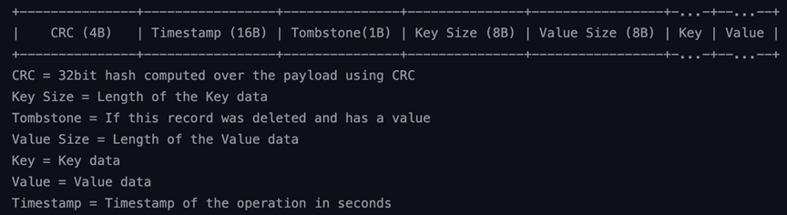
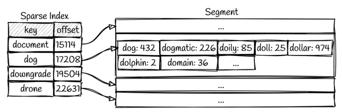

## Table of Contents  
- [Introduction](#introduction)  
- [Features](#features)  
- [Installation](#installation)  
- [Usage](#usage)
- [How It Works](#how-it-works)  
  - [Architecture Overview](#architecture-overview)  
  - [Data Storage](#data-storage)  
  - [Indexing](#indexing)  
  - [Querying](#querying)  
  - [Consistency](#consistency)  
- [Configuration](#configuration)  
- [Contributing](#contributing)  
- [License](#license)

# How it works

## Architecture Overview

The search engine is built around a modular architecture that separates concerns and ensures scalability. It uses:

  **Write Path** : For ingesting data efficiently and preparing it for search.      

  - Memtable : multiple in-memory instances active during program operations. Configuration allowing memtable size change. When an instance of memtable fills with data, data gets flushed to the disk. Apearance of the second instance allowing the engine to operate smoothly while the data is being written to the disk.
      - SSparser performing the memtable instance management as well as transforming memtable data to a valid sstable format. Calclating data chunk offsets and forming index summary tables.

  - SStable : data structured on the disk. Configuration allowing 2 types of aproach. Single file sstable or a multiple file sstable. Consisting of metadata, filter, merkle tree, summary, index and data parts. 
      - Block manager allows smooth data writes/reads in fixed size blocks (possible configuration). Using file writers and readers on top of an instance of block manager we allow for block manager component to be recycled through the project while eliminating tight coupling, and reducing reads of non-important data.

  **Read Path**: For executing search queries and returning results.

  **Cache Layer**: For optimizing frequently accessed data. 
      - Block cache: comopnent relying on LRU algorithm. Consisting of a doubly linked list storing actual block data and a hash map storing key-value pairs [block id , file name] : data_pointer. This aproach allows our system to have constant cache access time.
  **Bloom Filter**: For optimizing data lookups. If the key is not present in the bloom filter, we continue the lookup in other sstable files. Loaded into memory.

  **SStable Summary**: For optimizing data lookups. In the isection of sorted keys we choose ranges that are present in the summary. Loaded into memory. 

  

## Data Storage

Data is managed through an efficient combination of in-memory and disk-based storage:

### Write-Ahead Log (WAL): Ensures durability by recording operations before applying them.
- **WAL** resembles the staple of stability in the system. By using WAL we can track the trace of our system operations running even when the system expiriences an unexpected crash.

### Memtable: Temporarily holds records in memory for fast writes and retrievals.

### SSTable: Stores data persistently on disk, organized into levels for efficient compaction and retrieval.
  - Current version does not support lsm tree optimization (organization into levels).

Indexing is at the core of the search engine's functionality.

This structure is clear and matches the requested template. It provides a thorough explanation of the search engine's workflow and underlying mechanisms. Let me know if additional details or modifications are needed!